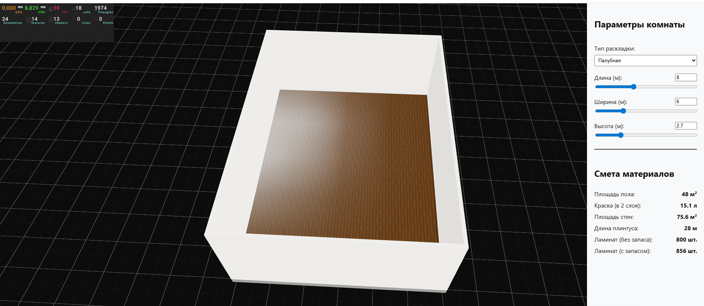
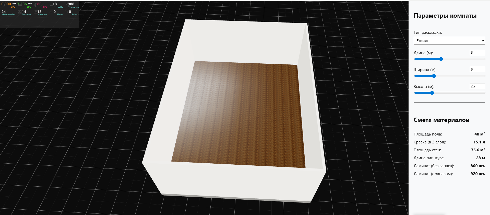

# Refloor

<details>
  <summary>📸 Посмотреть скриншоты интерфейса и метрик производительности</summary>
  
  ### Палубная раскладка (Straight layout)
  
  
  ### Раскладка "Ёлочка" (Herringbone layout)
  
</details>

## Возможности

- динамическая генерация комнаты
- procedural generation раскладки пола
- раскладка "ёлочка"
- GPU instancing
- расчёт материалов
- реактивное изменение размеров комнаты
- strict TypeScript configuration

### Расчёты материалов

На основе размеров комнаты автоматически рассчитываются:

- **Площадь пола:** $S_{\text{floor}} = \text{length} \times \text{width}$
- **Длина плинтуса (периметр):** $P = 2 \times (\text{length} + \text{width})$
- **Площадь стен:** $S_{\text{wall}} = P \times \text{height}$
- **Расход краски (в 2 слоя):** $V_{\text{paint}} = S_{\text{wall}} \times 0.2$ л (при константе расхода **0.2 л/м²**)
- **Количество плашек ламината:** рассчитывается на основе площади помещения, площади одной плашки и технологического запаса на подрезку. 
   Формула: $N_{\text{total}} = \lceil N_{\text{actual}} \times K_{\text{waste}} \rceil$, 
   где коэффициент запаса $K_{\text{waste}}$ составляет 1.15 (15%) для укладки "ёлочкой" и 1.07 (7%) для палубной раскладки.

## Технологии

- React
- TypeScript
- React Three Fiber
- Three.js
- Zustand
- Vite

## Архитектура

### Генерация геометрии

Раскладка пола генерируется процедурно на основе размеров комнаты и параметров плашек.

Алгоритм рассчитывает:
- позицию
- rotation
- размеры
- offsets

без хардкода координат.

### Оптимизация рендера

Для рендера большого количества плашек используется instancing через `@react-three/drei/Instances`.

Это позволяет:
- переиспользовать одну geometry
- уменьшить количество draw calls
- снизить нагрузку на CPU

### Структура проекта

Проект организован по принципам Feature-Sliced Design (FSD).

Основные части приложения разделены на:
- **widgets:** крупные переиспользуемые узлы интерфейса (например, панель управления конфигуратором `ControlsPanel`).
- **entities:** бизнес-сущности (например, параметры комнаты или логика расчета материалов).
- **shared:** переиспользуемые модули, компоненты и утилиты общего назначения (кнопки, инпуты, базовые 3D-компоненты).

что упрощает масштабирование и поддержку проекта.

### State management

Для хранения параметров комнаты используется Zustand.

3D-сцена подписывается только на необходимые части состояния, что уменьшает лишние React rerender внутри Canvas.

### Code Quality

Проект использует:

- ESLint
- Prettier
- Husky
- lint-staged

для автоматической проверки качества кода перед commit.

## Этапы реализации

### Stage 0
- настройка проекта
- ESLint / Prettier
- strict TypeScript
- Git workflow
- Husky

### Stage 1
- генерация комнаты
- динамические стены
- OrbitControls
- реактивные размеры

### Stage 2
- procedural floor layout
- herringbone layout
- instanced rendering
- clipping planes

### Stage 3
- расчёт материалов
- расчёт краски
- расчёт плинтуса
- UI панели управления

### Stage 4 (Финализация)
- Добавление альтернативной «Палубной» раскладки (straight layout)
- Интеграция переключателя типов укладки в ControlsPanel с динамическим изменением коэффициентов запаса материала ($K_{\text{waste}}$)
- Рефакторинг стилей интерфейса, перевод компонентов на изолированные CSS Modules
- Финальное тестирование, оптимизация сборки и подготовка к сдаче ТЗ

### Производительность

Текущая реализация оптимизирована через GPU instancing и подходит для интерактивной работы с типовыми размерами помещений.

При экстремально больших размерах комнаты (например 20×20 м) количество инстансов и shadow calculations может заметно увеличивать нагрузку на GPU, что потенциально может снижать FPS.

В качестве дальнейших оптимизаций могут использоваться:
- adaptive shadow quality
- frustum culling
- LOD-подходы
- переход на более низкоуровневый InstancedMesh

### Допущения

Текущая реализация:

- поддерживает только прямоугольные помещения
- использует фиксированные размеры плашек
- не учитывает двери и окна

Допущение по расчетам (WebGL-клиппинг vs Смета): 
- Смета в UI рассчитывает чистое физическое количество материалов для закупки (исходя из площади помещения и коэффициента технологического запаса в 15% на подрезку). 
- При этом визуальная 3D-модель использует паттерн «бесконечной сетки», генерирующей избыточные объекты ламината за пределами стен, которые затем аппаратно обрезаются с помощью clippingPlanes на уровне GPU. 
- Количество фактически инстансированных мешей в сцене не равно расчетному количеству плашек в смете.

### Возможные улучшения

- поддержка диагональной/кастомной раскладки
- поддержка произвольной формы помещений
- физическая генерация подрезанных элементов вместо GPU clipping
- adaptive quality для больших помещений
- batching/material atlasing для экстремально больших сцен

## Запуск проекта

```bash
npm install
npm run dev

